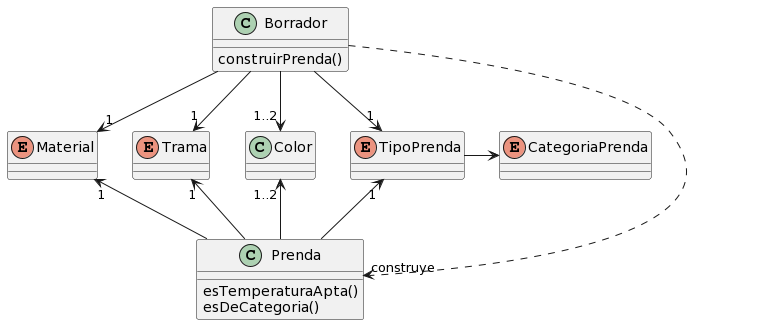

#### QMP2:
 
Ante al requerimiento de poder cargar las prendas en "pasos" (primero tipo, luego materiales y etc) me surgió el conflicto de cómo implementarlo de manera tal que en ningún momento se cargue una prenda que no este correctamente configurada (como podría pasar si se saltea alguno de los dos pasos mencionados). La primera solución que pensé fue hacerlo a través de una clase Borrador que tenga 2 metodos: el constructor en el que se especifica tipo, y getPrenda(), que recibe los demas atributos de una prenda propiamente configurada y devuelve la misma. En este caso, nunca se podria llegar a una prenda mal confuigurada porque no se podria terminar de configurar una prenda (paso 2) que no haya sido instanciada previamente (paso 1). El problema que surge con esto es que es **inflexible**, añadir el requerimiento de que se pueda crear una prenda en un paso más implicaría agregar OTRA clase intermedia para asegurar el orden, y así al infinito.
 
 
Dada esta implicación, descarté esa solucion y opté por una mas del estilo builder, donde existe la clase Borrador que tiene todos los atributos de una prenda con sus respectivos setters, por lo que se podría dividir la creación de una prenda en tantos pasos como se quiera pues la validación está en el método que la construye y devuelve. Ventajas: se resuelve el requerimiento del borrador, se gana flexibilidad y se libera la responsabilidad de la clase Prenda de validar que la carga sea correcta.
 
 
Respecto a las validaciones en Borrador, surge el conflicto de validar los tributos en los setters, en construirPrenda() o en ambos lugares. Validar contra null en los setters es fallar lo mas temprano posible, pero no asegura que no exista algun atributo nunca haya sido seteado, por lo que ví necesario validar en construirPrenda() para asegurar que TODOS los atributos tengan un valor valido a la hora de deviolver la prenda. Ante la posiblidad de validar en ambos lugares, decidí hacerlo únicamente en construirPrenda(), sacrificando la posibilidad de fallar lo antes posible pero ganando en el campo de la simplicidad del código.
 
 
Respecto al requerimiento de que la trama por defecto sea lisa, mi solución fue que dicho atributo se asigne LISO en el constructor de Borrador.
 
 

#### QMP4:
Ante el requerimiento de que la API del clima pueda cambiar en un futuro, decidi modelar ServicioClima como una interfaz e implementar una clase que adapte AccuWeatherAPI a la interfaz antes mencionada, todo esto para hacer que el sistema no sea dependiente de esa API en particular.

Ante el requerimiento de que se pueda cambiar la API, decidi implementar un service locator que contenga el ServicioClima que se este utilizando en un momento dado y permita cambiarlo a traves de un setter.

Para generar sugerencias, existe una clase Guardarropas que entiende un mensaje generarSugerencia() que primero filtra las prendas del usuario por temperatura y luego por categoria. De cara al futuro, creo que seria conveniente delegar esta logica a clases que implementen una interfaz en comun, de manera que se puedan generar atuendos con distintos criterios.

Con la idea de reducir los costos de los llamados a la API y hacer que se pueda testear la logica de generar atuendos segun la temperatura de manera deterministica, para los tests que implican el uso de algun ServicioClima, opte por hacer un mock de ServicioClima.

DC:

#### QMP5:
Se añade la clase User. Un User tiene una lista de Guardarropas y cada Guardarropa tiene una referencia al User que lo creo (dueño). Un usuario puede crear Guardarropas propios, añadir ajenos y enviar solicitudes a un Guardarropas para añadir o eliminar prendas. Las solicitudes de añadir y eliminar se modelaron como dos clases que heredan de una clase abstracta Solicitud que define la interfaz aceptar() y revertir(). Un Guardarropas recibe la solicitud y en caso de que el solicitante sea el dueño del guardarropas, se acepta automaticamente, caso contrario se "reenvía" la solicitud al dueño del Guardarropas, que puede aceptarla o rechazarla cuando quiera. La solicitudes aceptadas se guardan en el Guardarropas sobre el que tuvieron efecto a modo de historial, de manera que se puedan revertir.

Decidí separar el diagrama de clases en 3 para que sea mas entendible.

